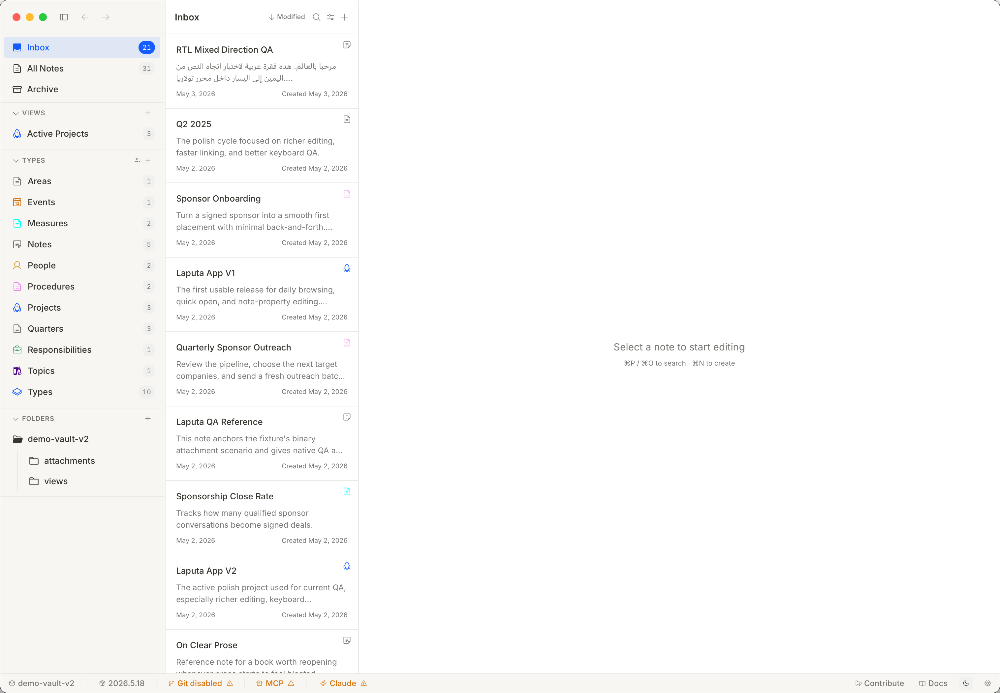
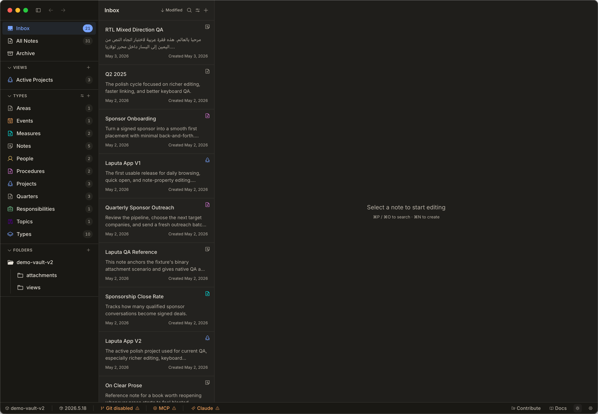

# Phase 2d — Big panel crates (planning outline)

Last shipped: Phase 2c at commit `3131ccc7`.  Phase 2a/2b/2c built the
topology + small chrome + wiring.  Phase 2d builds the substantial
panel crates that live inside the Docks and the center PaneGroup.

## Visual guide (authoritative)

| Theme | Reference |
|-------|-----------|
| Light |  |
| Dark  |  |

`tolaria-demo-vault-v2-light.png` and
`tolaria-demo-vault-v2-dark.png` are the **single source of truth**
for every chrome component's visual implementation.  Both capture the
Tauri-era app rendering `demo-vault-v2/`; the dark variant is reached
via the moon-icon theme switcher in the bottom-right of the status
bar.  The implementation goal is **minimum visual differences
against these screenshots** for every panel, row, header, badge,
spacing, colour, and typographic weight, in both light and dark
modes.

The legacy single-mode capture [`tolaria-demo-vault-v2.png`](tolaria-demo-vault-v2.png)
is kept for backward links but is superseded by the light/dark pair.

### React source = behavioural reference

The screenshots lock the **look**.  The existing React + TypeScript
components under `src/components/` (the Tauri-era frontend) lock
the **behaviour**: row interactions, hover/active states, count
derivation, keyboard handling, multi-select model, hide/show logic,
expand/collapse, sort/filter rules, copy text, and exact pill /
badge content.  When porting a chrome surface to Rust, read the
React counterpart first and follow it as the spec:

| Rust crate | React source(s) under `src/components/` |
|------------|-----------------------------------------|
| `sidebar_panel` | `Sidebar.tsx`, `sidebar/*.{tsx,ts}` (sections, group header, view item, type interactions) |
| `note_list_pane` | `NoteList.tsx`, `note-list/*.{tsx,ts}` (header, layout, pinned card, multi-select, filter pills, search) |
| `inspector_panel` | `Inspector.tsx`, `inspector/*.{tsx,ts}` |
| `ai_panel` | `AiPanel.tsx`, `AiPanelChrome.tsx`, `AiMessage.tsx`, `AiActionCard.tsx` |
| `status_bar` | `StatusBar.tsx`, `status-bar/*.{tsx,ts}` (badges, vault menu, AI agents badge) |
| `breadcrumb_bar` | `BreadcrumbBar.tsx`, `BreadcrumbBar.visibility.test.tsx` |
| `note_item` | The BlockNote + CodeMirror carry-overs in `src/components/blockNote*.ts` (the embedded editor body) |
| `command_palette` | `CommandPalette.tsx`, `CommandPaletteAiMode.tsx` |
| `quick_open` | `QuickOpenPalette.tsx` |
| `dialogs` | every `*Dialog.tsx` / `*Modal.tsx` under `src/components/` |
| `banners` | `ArchivedNoteBanner.tsx`, `TrashWarningBanner.tsx`, plus the 4 other plan-locked banners |
| `toasts` | `Toast.tsx` |
| `wikilink_inputs` | `Wikilink{Chat,Suggestion,Inline}.tsx` |
| `emoji_picker` | `EmojiPicker.tsx`, `TagsDropdown.tsx` |
| `image_lightbox` | `ImageLightbox.tsx` |
| `startup` | `WelcomeScreen.tsx`, `StartupScreen.tsx` |
| `settings_panel` | `SettingsPanel.tsx` + the 6 section files |
| `diff_view` | `DiffView.tsx` |

The corresponding `*.test.{ts,tsx}` files (often colocated) also
double as a behavioural spec — useful for porting edge-case
handling that isn't obvious from the visible component.

When in doubt during implementation, sample the pixel from the
reference image rather than improvising.  Periscope (Phase 6-MVP) is
the loop for verifying parity — capture the live app, diff against
this image, refine.

Specific anchors the screenshot locks in:

- **Window chrome** — native macOS traffic lights flush-left; back /
  forward / new-note triplet immediately right of the controls;
  right-side action cluster (search, star, lock, language, …, app
  switcher).
- **Sidebar (Left Dock)** — three section headers (`VIEWS`, `TYPES`,
  `FOLDERS`) in small-caps muted-foreground.  Inbox / All Notes /
  Archive sit above the first section header.  Each row: 16-px colour
  glyph + label (Inter ~13) + right-aligned count chip in muted text.
  Selected row paints `accent` background full-width with the row
  text in foreground/accent-fg.
- **Note list (centre column)** — fixed-width column (~280 pt) titled
  `Notes` with sort/filter glyphs on the right.  Each row: 14-px
  bold title, 12-px muted snippet (2–3 lines), 11-px muted metadata
  pair (`May X, 2026 · Created May X, 2026`).  Selected row paints a
  pale `accent-light` background.  Some rows carry a 14-px right-side
  status glyph (chart, blue circle).
- **Editor (right column)** — title rendered as H1 inside the editor
  body, large weight 600; body 14-px regular; placeholder `Enter
  text or type '/' for commands` in muted-foreground italic.
- **Status bar** — left cluster: workspace name (`demo-vault-v2`)
  with chevron + version (`2026.5.18`).  Right cluster: `Git
  disabled` (warning amber), `MCP` (warning amber), `Claude`
  (warning amber), `Contribute` (megaphone glyph) / `Docs` (book
  glyph) links, **theme switcher** (sun in light mode / moon in dark
  mode), and a trailing **settings** gear icon.  The theme switcher
  toggles the entire chrome between the two reference variants — it
  is the user's primary control for swapping appearance and must
  land on the GPUI side as a `theme::ThemeChoice` cycler wired to
  `gpui_component::theme::Theme`.

Component-level "match-to-image" notes are inlined per crate under
[Per-crate guidance](#per-crate-guidance) below.

## Scope

Seven new chrome crates, each implementing the `workspace::Panel` trait
(panels) or rendering inside `Pane` (content):

| Crate | Owns | Mock source | Reference region |
|-------|------|-------------|------------------|
| `sidebar_panel` | Left Dock; types + saved views + folders + workspace selector | MockVault | left column of `tolaria-demo-vault-v2.png` |
| `note_list_pane` | Center pane content; filter + list + bulk action bar | MockVault + MockSearch | middle column of `tolaria-demo-vault-v2.png` |
| `inspector_panel` | Right Dock; 7 sub-panels (properties / outline / backlinks / instances / referenced-by / relationships / git history) | MockVault + MockGit | right column of `tolaria-demo-vault-v2.png` (collapsed in capture; render same row treatment as sidebar) |
| `ai_panel` | Right Dock companion; AI chat surface | MockAi | shares right-dock chrome with inspector |
| `search_panel` | Bottom Dock; full-text search results | MockSearch | not captured (bottom dock collapsed) — match sidebar row treatment |
| `settings_panel` | Modal/workspace item; settings UI | MockSettings | follow modal style of dialogs |
| `diff_view` | Modal/panel; diff renderer | MockGit | not captured — match editor body typography |

## Sequence

These can largely proceed in parallel.  Suggested wave structure:

- **Wave 1** (smallest, most isolated): `search_panel`, `diff_view`, `settings_panel`
- **Wave 2** (Dock panels — implement `Panel` trait): `sidebar_panel`, `ai_panel`
- **Wave 3** (largest — 7 sub-panel composition): `inspector_panel`, `note_list_pane`

Each wave: parallel builders + centralized reviewer (pattern from Phase 2b).

## Per-crate guidance

Every crate's exit criterion is **"the panel matches its region in
[`tolaria-demo-vault-v2.png`](tolaria-demo-vault-v2.png) with the
minimum visual delta achievable in pure GPUI"**.  When implementation
shortcuts the visual (placeholder styling, missing icons, wrong
weights) it must carry a `TODO(visual-parity)` comment so a periscope
diff pass can find it later.

### sidebar_panel
- Implement `workspace::Panel` (position=Left, default_size=240px, starts_open=true).
- Render `gpui_component::Sidebar` primitive with **five** clusters,
  matching the column in `tolaria-demo-vault-v2.png`:
  1. **Top-level rows** (no header): `Inbox` (count badge), `All Notes`
     (selected → accent background, count badge), `Archive`.
  2. **`VIEWS`** (small-caps muted header, `+` trailing button): saved
     view rows — demo set of 1+ with count badge (`Active Projects 6`).
  3. **`TYPES`** (header + `+`): one row per distinct `NoteKind` /
     type from MockVault, with a 16-px colour-coded leading glyph and
     a trailing count badge.  Colours come from each type's
     accent-colour token (see screenshot: Areas=violet, Events=teal,
     Measures=blue, …).
  4. **`FOLDERS`** (header + `+`): vault root as a collapsible row
     (`demo-vault-v2` ▾) with nested folder rows
     (`attachments`, `views`).
  5. Row treatment: 28-px row height, 16-px leading glyph, label (Inter
     13), right-aligned count chip (12-px muted).  Selected row paints
     `theme.accent` full-width.
- Selecting an item emits an event the workspace can subscribe to.

### note_list_pane
- Implement `workspace::Panel` (custom or center; check Zed pattern).
- Header bar (44 px tall, bottom-border 1 px): title `Notes` left, 4
  trailing glyph buttons (sort, filter, etc.) — match the screenshot's
  middle-column top strip.
- Card-style rows (already shipped in
  `crates/note_list_pane/src/lib.rs` per `component/NoteListItem` in
  `ui-design.pen`).  Visual deltas still to close from the screenshot:
  - Add the **metadata line**: `May X · Created May X` in 11-px muted
    text below the snippet (currently dropped).
  - Add the **trailing status glyph** for note types that carry one
    (chart icon, blue circle).
  - Selected row paints `theme.accent_subtle` (pale-accent bg) full
    width — see the `Q2 2025` row in the reference.
- Filter / bulk action bar wired (already in place); visual sweep to
  match toolbar treatment in the screenshot.
- Virtualised list (defer real virtualization — eager render).

### inspector_panel
- Implement `workspace::Panel` (position=Right, default_size=320px, starts_open=true).
- 7 sub-panels via `gpui_component::Accordion`:
  1. Properties (key/value table from MockNote.properties)
  2. Outline (extracted headings from content)
  3. Backlinks (synthetic — 2-3 fake links)
  4. Instances (count of NoteKind matches)
  5. Referenced-by (inverse of backlinks)
  6. Relationships (synthetic graph)
  7. Git history (last 5 MockCommits)
- Section headers + row treatment mirror sidebar (small-caps muted
  header, 28-px row, count chip on the right).  Reference screenshot
  captures the right dock collapsed — use the sidebar's row geometry
  as the visual contract until a later capture exposes it.

### ai_panel
- Implement `workspace::Panel` (Right Dock companion — alternate visibility with inspector).
- Renders MockAi thread (4 turns) using gpui-component's chat-style layout.
- Send-message input at bottom; on enter, calls `MockAi::send_message`.

### search_panel
- Implement `workspace::Panel` (position=Bottom, default_size=200px, starts_open=false — toggle via action).
- Search input + result list with snippet excerpts from MockSearch.
- Result rows reuse note_list_pane's card geometry (title / snippet /
  metadata) so the visual language stays consistent with the
  reference screenshot.

### settings_panel
- `Panel` OR `ModalView` — decision: ModalView (matches the React `Dialog`-based pattern).
- Multi-tab settings UI: General, Editor, Git, AI, Vault.
- Each tab reads from MockSettings; Phase 3 wires to real `settings_store`.

### diff_view
- `ModalView` (full-screen).
- Renders MockGit diff (synthetic — two side-by-side text panes).
- Body typography matches the editor's monospace settings so diff
  blocks feel native to the rest of the chrome.

### status_bar (already shipped — visual parity pass)

Not a Phase 2d deliverable, but `tolaria-demo-vault-v2.png` locks
its visual contract:

- Left cluster: workspace name (`demo-vault-v2`) + chevron, version
  label (`2026.5.18`).
- Right cluster: amber-warning service chips (`Git disabled`, `MCP`,
  `Claude`), then plain links (`Contribute`, `Docs`).
- 24-px tall, 1-px top border, `theme.muted` background.

### window chrome (`tolaria` binary — visual parity pass)

The custom title-bar strip seen in the reference is a Tolaria-owned
NSView region above the workspace.  Native traffic-lights stay on
the left; the action triplet (back / forward / new-note) and the
right-side action cluster (search, star, lock, language, more,
profile) sit in this region.  Decisions on icon source, exact
spacing, and whether to draw the strip in GPUI or rely on
`TitlebarOptions::traffic_light_position` are deferred but the
screenshot is the target.

## Hard rules (carry-over from Phase 2b)

- Each crate is self-contained; no cross-panel deps.  Plumbing through
  TolariaWorkspace events is Phase 2e or later.
- Every crate's tests use `install_theme(cx)` helper pattern from
  `crates/embed_poc/src/layout.rs:243`.
- Mock services accessed via the `Global` accessor pattern; never
  hold mock data inline in panel state.
- Builders use the parallel team pattern (4 in parallel for Wave 1,
  then 2 + 2 + 2 for Waves 2/3).
- Centralized reviewer (single teammate, hand off as crates finish).
- `cargo fmt` + per-crate test green + workspace clippy `-D warnings`
  before any commit.
- `cargo build --workspace` clean per crate landing (no cascade
  breakage on tolaria, embed_poc, or sibling chrome crates).

## Phase 2e — Remaining surfaces (preview)

Modals and small composers that round out the chrome inventory:

- `command_palette` — `Picker<CommandPaletteDelegate>` modal (uses `ui::Picker`)
- `quick_open` — `Picker<QuickOpenDelegate>` modal
- `dialogs` — all 11 plan-locked dialog views (Commit, ConfirmDelete, CreateNote, CreateType, CreateView, Feedback, McpSetup, TelemetryConsent, GitRequiredModal, ConflictResolverModal, AddRemoteModal, CloneVaultModal, NoteRetargetingDialogs, RetargetNoteDialog, OnboardingShell)
- `wikilink_inputs` — `Picker`-based combobox for wikilinks
- `image_lightbox` — full-screen image viewer modal
- `emoji_picker` — popover grid
- `startup` — WelcomeScreen + StartupScreen views

These mostly compose existing primitives (`Picker`, `Dialog`, `Popover`)
so each crate should land in <300 LOC.
