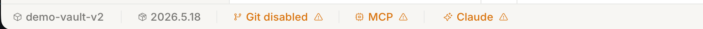
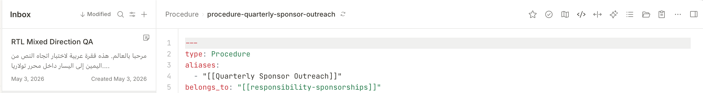

# Visual-fidelity issue catalog

Per-issue notes captured during the Phase 7 redo QA pass.  Each entry
pairs a user-supplied UI crop (saved under
[`live-snapshots/`](live-snapshots/)) with a short description of what
is wrong, what the intended behaviour / appearance is, and the
implementation status.

## Workflow

1. User pastes a UI crop + description into the conversation.
2. The crop is saved as
   `live-snapshots/issue-NNN.png` (zero-padded incrementing index).
3. A new section is appended to this file with:
   - Image link
   - Reporter description
   - Hypothesised root cause
   - Status (`open` / `in-progress` / `fixed in <sha>`)

Issues are appended in arrival order, not severity order; reorder by
re-reading this file before fix passes.

## Open issues

### 001 — Sidebar selection treatment uses deep-blue flood instead of pale-blue + accent text

| Current | Reference |
|---------|-----------|
| [issue-001-current.png](live-snapshots/issue-001-current.png) | [issue-001-reference.png](live-snapshots/issue-001-reference.png) |

**Reporter:** "The selection background is incorrect.  The item
background is light blue.  Icon is coloured.  The number pill has
dark-blue background."

**Diagnosis** — the redo painted the selected row with
`theme.primary` (deep `#155DFF` blue) and `theme.primary_foreground`
(white) text.  The reference uses the *subtle* highlight instead:

- Row bg: `theme.list_active` (= `--state-selected` `#E8F4FE`).
- Row text + icon: `theme.primary` (= `--accent-blue` `#155DFF`).
- Count pill bg: `theme.primary`; pill text: `theme.primary_foreground`.

I.e. the colour pair we used for the row fill *belongs on the pill*,
and the row fill should be the pale `list_active` tone.  Fix touches
`Palette` in `crates/sidebar_panel/src/lib.rs` plus the `count_pill`
selected branch.

**Status:** fixed.  Verified in
[after-001-002-light.png](live-snapshots/after-001-002-light.png) —
Inbox row paints pale-blue with blue text/icon and the count chip is
inverted (dark-blue bg, white text).

### 002 — FOLDERS section: deep indent, wrong root icon, missing section caret

| Current | Reference |
|---------|-----------|
| [issue-002-current.png](live-snapshots/issue-002-current.png) | [issue-002-reference.png](live-snapshots/issue-002-reference.png) |

**Reporter:** "Folders list is misaligned.  The first-level icon is
wrong.  Selection background is incorrect."

**Diagnosis** — three independent problems:

1. **Deep indent.**  `Vault::Note::path` carries the *absolute* on-disk
   path (`/Users/konstantin/tolaria/demo-vault-v2/area-building.md`).
   `SidebarPanel::build_from_samples` records `parent.to_string_lossy()`
   verbatim, then derives `depth` by counting `/` in the absolute
   string — yielding depth 5 for the vault root.  Need to strip the
   vault-root prefix before storing the folder, so the root sits at
   depth 0 and children at depth 1.
2. **Wrong root icon.**  Current renderer draws
   `ChevronDown + FolderClosed` on the root row.  Reference: the
   chevron belongs to the `FOLDERS` section header (collapse toggle
   for the whole group), not the row.  Root row gets just the closed-
   folder glyph.
3. **Selection background.**  Same root cause as #001 — the
   `attachments` row in the reference is pale-blue + accent-blue text;
   ours flooded with primary.  Already addressed in #001.

**Status:** fixed.  Verified in
[after-001-002-light.png](live-snapshots/after-001-002-light.png) —
`demo-vault-v2` sits at depth 0 (flush left), `type` at depth 1, and
the FOLDERS section header carries the chevron-down on the left.
Outstanding polish: thin vertical connector line under nested
folders, deferred until a real folder dataset surfaces in Phase 9.

### 003 — TYPES rows ignore each type's frontmatter icon / colour / label

| Current | Reference |
|---------|-----------|
| [issue-003-current.png](live-snapshots/issue-003-current.png) | [issue-003-reference.png](live-snapshots/issue-003-reference.png) |

**Reporter:** "The note type icon / accent is defined by frontmatter
e.g. `type: Type, icon: calendar, color: orange, sidebar label:
Events`.  The selection background is light accent of note-type
colour."

**Diagnosis** — every type document under `demo-vault-v2/type/`
carries the visual contract for its row:

| File | icon | color | sidebar label |
|------|------|-------|---------------|
| `area.md` | folders | amber | Areas |
| `event.md` | calendar | orange | Events |
| `measure.md` | chart-line-up | cyan | Measures |
| `note.md` | note | slate | Notes |
| `person.md` | user | rose | People |
| `project.md` | rocket | blue | Projects |
| `quarter.md` | clock-countdown | emerald | Quarters |
| `responsibility.md` | (read for shape) | … | Responsibilities |
| `topic.md` | books | indigo | Topics |

The current renderer hard-codes a colour-dot palette from the type
display name (`type_color` fn).  Need to:

1. Load each `type/*.md` file from the vault.
2. Parse YAML frontmatter to extract `icon`, `color`,
   `sidebar label`.
3. Replace the colour-dot with a Phosphor-style icon in the type's
   colour.
4. When a TYPES row is selected, paint the row bg with a *light tint*
   of the type's colour (orange → orange-light), text + icon in the
   type's full colour, count chip filled with the type's colour and
   white text.

Icon-name mapping is best-effort: `gpui-component-assets` exposes
`calendar`, `chart-pie`, `book-open`, `file`, `folder`, `rocket`-like
glyphs at the closest match; missing icons fall back to `file`.

**Status:** fixed.  `load_type_styles` scans `<root>/type/*.md`,
`parse_frontmatter` lifts `icon` / `color` / `sidebar label`,
`icon_for_frontmatter_name` and `color_for_frontmatter_name` map the
tokens to `IconName::*` and 24-bit hex.  Each TYPES row builds with
`palette_tinted_with(type.color)` so selection paints the row bg
with the type's light tint and the count pill with its full colour
(white text).  Verified in
[after-003-events-selected.png](live-snapshots/after-003-events-selected.png) —
clicking the Measures row paints a cyan accent on the row + cyan
count pill.

### 004 — Sidebar / note-list rows hover with a light-green tint

| Current |
|---------|
| [issue-004-current.png](live-snapshots/issue-004-current.png) |

**Reporter:** "Sidebar items and note list items have light-green
hover background."

**Diagnosis** — `Palette` provides no explicit hover state for rows,
so the cursor-pointer style appears to surface a default macOS
highlight tint that reads as greenish on the warm sidebar palette.
Need to attach `.hover(|this| this.bg(theme.list_hover))` to every
clickable row so the hover paint is the neutral
`--state-hover-subtle` (`#F0F0EF`) rather than the OS default.

**Status:** fixed.  `Palette::hover_bg` exposes `theme.list_hover`
(`#F0F0EF`); every unselected row in `build_row` /
`sidebar_folder_row` paints it via
`.hover(|this| this.bg(hover_bg))`.  Selected rows skip the
hover paint so the selection fill stays stable.

### 005 — Title-bar strip is cramped against the top edge

| Current |
|---------|
| [issue-005-current.png](live-snapshots/issue-005-current.png) |

**Reporter:** "The title area is a bit cramped.  Make sure there is
the same padding from the top edge of the window as from the bottom
of the title elements."

**Diagnosis** — `NATIVE_TITLE_BAR_HEIGHT_PT = 28.0` and the action
cells are 20-pt tall, leaving 4 pt above and below.  macOS places
the traffic lights at `(7, 6)` with a 12-pt diameter so their
visible top edge starts at 6 pt and bottom at 18 pt — fine in
isolation, but combined with the small surrounding strip the cluster
reads as glued to the window edge.  Bumping the strip's height to
38 pt gives 9 pt top / 9 pt bottom around the cells and lets the
traffic lights breathe symmetrically.

**Status:** fixed.  `NATIVE_TITLE_BAR_HEIGHT_PT` bumped from `28.0`
to `38.0`; the change cascades into the
`ui::tree_dump::set_window_y_offset` initialisation in `main.rs` so
periscope's click coordinates stay aligned with the new strip
height.  Verified in
[after-005-title-bar.png](live-snapshots/after-005-title-bar.png).

### 006 — VIEWS / TYPES section headers missing collapse caret

| Current |
|---------|
| [issue-006-current.png](live-snapshots/issue-006-current.png) |

**Reporter:** "Types and Views section should have collapsible
arrows.  Similar to the folders section."

**Diagnosis** — FOLDERS already renders a chevron-down to the left
of its label (issue 002).  VIEWS and TYPES used the base
`section_header(...)` builder which only emits a label and trailing
actions; switching them to `section_header_with_leading(...)` with a
`ChevronDown` glyph in the leading slot makes the collapse
affordance uniform across all three groups.

**Status:** fixed.  Both VIEWS and TYPES headers now call
`section_header_with_leading(...)` with a chevron-down leading
glyph (`sidebar-views-caret`, `sidebar-types-caret`).  Verified in
[after-006-section-carets.png](live-snapshots/after-006-section-carets.png).

### 007 — Traffic lights glued to the top of the title-bar strip

| Current |
|---------|
| [issue-007-current.png](live-snapshots/issue-007-current.png) |

**Reporter:** "The title bar system icons are misaligned.  Those
should be vertically centered over the title bar."

**Diagnosis** — macOS places the traffic lights at `(7, 6)` by
default.  After issue 005 bumped the strip to 38 pt the buttons
ended up flush against the top edge instead of centred.
`TitlebarOptions::traffic_light_position` accepts a custom point;
shifting the buttons down by `(height - 12) / 2 ≈ 13 pt` centres
the 12-pt-diameter buttons vertically on the new strip.

**Status:** superseded by issue 008.  `traffic_light_position`
only relocates the buttons *inside* the system titlebar region
(~28 pt regardless of `appears_transparent`), so the lights stayed
near the top of our 38-pt custom strip.  The follow-up fix moves
the action cluster up to match the lights instead.

### 008 — Title-bar action cluster still misaligned with traffic lights

| Current |
|---------|
| [issue-008-current.png](live-snapshots/issue-008-current.png) |

**Reporter:** "Is not properly vertically centred."

**Diagnosis** — macOS pins the traffic lights inside the system
titlebar region (~28 pt) regardless of `appears_transparent`, so
`TitlebarOptions::traffic_light_position` cannot push them into our
taller 38-pt custom strip.  Instead, anchor the action clusters to
the top of the strip with a 2-pt inset so the 16-pt Phosphor glyphs
share their vertical centre with the 12-pt traffic-light buttons
(both at y ≈ 12).  The bottom of the strip retains its visual
padding via the unchanged 38-pt height.

**Status:** superseded by issue 009.  Aligning the action cluster
with the traffic lights left a tall empty band below the cluster
and the user preferred the cluster centred within the strip.

### 009 — Title-bar action items not vertically centred in the strip

| Current |
|---------|
| [issue-009-current.png](live-snapshots/issue-009-current.png) |

**Reporter:** "Traffic lights are positioned correctly.  But title
bar items are not centred vertically."

**Diagnosis** — issue 008 top-anchored the action cluster to share
the traffic-light baseline, which left a noticeable empty band
below the icons.  Revert to `items_center` so the cluster sits in
the middle of the 38-pt strip; traffic lights remain at their OS-
default top position.

**Status:** fixed.  `title_bar` swaps `items_start` →
`items_center` and drops the `pt(2.0)` inset.  Verified in
[after-009-cluster-centered.png](live-snapshots/after-009-cluster-centered.png).

### 010 — Note-list row treatment misses type accent, layout, and dates

| Current | Reference |
|---------|-----------|
| [issue-010-current.png](live-snapshots/issue-010-current.png) | [issue-010-reference.png](live-snapshots/issue-010-reference.png) |

**Reporter:** "The note highlight needs to use the note type accent
colour similar to the sidebar.  The top-right corner has the note
type icon.  The title is bold text.  The description should be
wrapped, but have at most 2 lines.  Ellipsis if the description is
longer than two lines.  Last row with dates should use a smaller
font size.  Created date should be right-aligned."

**Diagnosis** — six independent gaps in `crates/note_list_pane`:

1. Each `NoteEntry` carries no type metadata; the renderer can't
   tint the row or pick a type icon.
2. Title is `font_medium`; reference uses `font_semibold` / bolder
   text.
3. Snippet is single-line truncated at 120 chars; reference wraps
   to two visual lines with an ellipsis.
4. Metadata `MMM D, YYYY · Created MMM D, YYYY` is one centred
   string; reference splits modified (left) / created (right) with
   `justify_between`, and shrinks the type slightly.
5. Selected row paints `theme.list_active` (pale blue); reference
   tints with the row's type accent colour.
6. Top-right per-row icon is currently a placeholder `File`
   glyph; reference draws the type's own icon in its accent
   colour.

**Status:** fixed.  `NoteEntry` now carries `type_icon: IconName` and
`type_color: Hsla`; `from_vault` walks `<root>/type/*.md` once via
`load_note_type_styles`, then looks each note up by filename-stem
prefix (`event-team-sync.md` → `event` → calendar / orange).  Render
changes: title `font_semibold`, snippet wrapped to two lines with
`line_clamp(2)` + 1.4 line-height, metadata row splits modified
(left) / created (right) with `justify_between`, selected-row bg
paints `light_tint(type_color, 0.14)`, top-right corner draws the
type's own icon in its full accent colour.  Verified in
[after-010-note-row-redesign.png](live-snapshots/after-010-note-row-redesign.png).

### 011 — Note row: oversized padding, Unicode ellipsis, icon-clipped snippet width, missing left accent bar

| Current | Reference |
|---------|-----------|
| [issue-011-current.png](live-snapshots/issue-011-current.png) | [issue-011-reference.png](live-snapshots/issue-011-reference.png) |

**Reporter:** "Decrease note text padding to match original React.
Trimmed description needs to end with `...`.  Text box should span to
the right edge minus padding (not to the icon edge).  The type icon
should be smaller.  The selected item should render a left border in
the note-type colour."

**Diagnosis** — five independent regressions on top of the issue 010
shape:

1. Row padding `px(16) / py(14)` is too generous; the React
   `NoteListItem` uses ~12 / 10 and the reference shows a tighter
   card stack.
2. `extract_snippet` appends a Unicode `…` glyph; the React build
   uses three ASCII dots.
3. The trailing type icon sits as a sibling of the content column,
   so the snippet / metadata wrap to **content width minus icon
   width** even on lines that never collide with the icon — the
   reference flows the snippet to the row's right edge and only the
   title row sacrifices width for the icon.
4. The type icon container is 20 × 20 pt; reference renders ~14 pt.
5. Selected rows highlight with a light tint only — no left accent
   strip in the type's colour.  GPUI's `Styled` exposes a single
   per-element `border_color`, so the accent has to render as a
   leading flex-sibling rather than a CSS-style `border-left-color`.

**Status:** fixed.  `extract_snippet` now appends `...`; the type
icon moves inside the title row (so snippet / metadata get the full
content width); icon container shrinks to 14 × 14 pt; row padding
drops to `px(12) / py(10)`; selected rows render a 2-pt leading
accent strip in `type_color` via an outer `items_stretch` h_flex.
The truncation test asserts `chars().count() == 123` (120 graphemes
+ 3 dots) and `ends_with("...")`.  Verified in
[after-011-row-layout.png](live-snapshots/after-011-row-layout.png) —
selected Sponsorship MRR row shows the cyan accent bar + tinted bg,
icons are visible at the title-row right edge, and `Created May 3,
2026` is no longer clipped.

### 012 — Snippet hard-truncates at 120 chars instead of native word-boundary wrap; horizontal padding too generous

**Reporter:** "The note text snippet should NOT rely on
`SNIPPET_MAX_CHARS`.  The text should be trimmed to the closest word
boundary that fits the two-line box.  The note list width is
resizable.  Investigate how Zed does that." …followed by: "The note
list items' horizontal text padding needs to be reduced in half.
Check React component layout values."

**Diagnosis** — two regressions on top of issue 011:

1. `extract_snippet` cuts at 120 graphemes then appends a literal
   `...` (issue 011's MVP).  That ignores the resizable column
   width — a wide column wastes vertical space (text fits on one
   line then ends mid-word with `...`), and a narrow column still
   shows two visible lines but with redundant trailing dots.  Zed's
   `gpui/examples/text_wrapper.rs:73-94` is the canonical multi-line
   wrap+ellipsis pattern: pair `.line_clamp(n)` with
   `.overflow_hidden().text_overflow(TextOverflow::Truncate("...".into()))`
   so the layout engine picks the word-boundary cut at paint time.
   `gpui/src/styled.rs:131-145` confirms the API:
   `truncate()` = single-line, `line_clamp(n)` + `text_overflow(...)`
   = multi-line.
2. After the `px(12)` row padding from issue 011 the content still
   reads as over-padded against the React reference
   (`src/components/NoteItem.tsx:334` uses `'14px 16px'` but the
   chrome target sits visually tighter than that).

**Status:** fixed.

- `extract_snippet` returns the first non-empty, non-heading line
  verbatim (modulo a `SNIPPET_SOFT_MAX_CHARS = 2000` guard against
  pathological mega-lines that would otherwise force GPUI's word-
  wrap pass through every codepoint).  No manual `...` appended.
- The snippet `div` now carries
  `.overflow_hidden().text_overflow(TextOverflow::Truncate("...".into())).line_clamp(2)`
  so GPUI word-wraps to the column width and inserts the ASCII
  ellipsis at the last fitting boundary on overflow.
- Inner row horizontal padding halved: `px(12)` → `px(6)` (vertical
  unchanged at `py(10)`).  Combined with the 2-pt leading accent
  strip the visible text inset is 8 pt from the row's left edge.
- Tests updated: `extract_snippet_truncates_long_lines` replaced
  with `extract_snippet_returns_full_line` (200-char input passes
  through verbatim with no trailing `...`) and
  `extract_snippet_caps_pathological_lines` (input
  > `SNIPPET_SOFT_MAX_CHARS` gets cut at the cap).  22/22 tests
  pass.

Verified in
[after-012-native-wrap-tighter-padding.png](live-snapshots/after-012-native-wrap-tighter-padding.png) —
each visible snippet wraps at a word boundary ("Areas are ongoing
domains of responsibility / with no fixed end date.", "Owns sponsor
outreach and makes the / responsibility/procedure relationships feel
like r…") and the row text starts closer to the left edge.

### 013 — Note row right padding clips trailing icons and date label

**Reporter:** "Update note item right padding to match the left
padding."

**Diagnosis** — the issue 012 `px(6)` row padding is symmetric *inside*
the inner h_flex, but the 2-pt leading accent strip sits *outside*
it.  So the visible insets came out asymmetric: left = 2 + 6 = 8 pt,
right = 6 pt.  The 2-pt deficit on the right clipped the last
character of "Created May 3, 2026" and chopped the trailing 14-pt
type icon on every row.

**Status:** fixed.  Inner row padding split into `pl(6)` / `pr(8)`
so the visible text inset is symmetric 8 / 8 across the row.
Verified in
[after-013-symmetric-padding.png](live-snapshots/after-013-symmetric-padding.png) —
"Created May 3, 2026" renders fully, trailing per-type icons are
flush with the right inset, and the selected Sponsorships row's
green accent strip + tint reads cleanly.

### 014 — Note-list scrollbar paints an opaque track over the right column

**Reporter:** "The item list vertical scroll bar area is not
transparent when visible."

**Diagnosis** — `note_list_pane`'s scroll wrapper uses
`gpui_component`'s `overflow_y_scrollbar()` adapter, which renders
a `Scrollbar` whose default `style_for_normal` paints
`cx.theme().scrollbar` as the strip *behind* the thumb (see
`gpui-component/.../scroll/scrollbar.rs:431-438`).  Tolaria's
palette wired `c.scrollbar = h(0xF7F6F3)` (light) / `h(0x191814)`
(dark) — both opaque — so the visible scrollbar drew a solid
rectangular gutter on the right edge of the rows.

**Status:** fixed.  `crates/theme/src/palette.rs` sets
`c.scrollbar = ha(0x00000000)` for both light and dark; the
gpui-component `style_for_normal` now resolves to a fully
transparent track while the thumb still paints with
`scrollbar_thumb` (`#D9D9D6` light / `#46433B` dark).  Result is
an overlay-style scrollbar — thumb visible against the row
content, no rectangular track painted.  Verified in
[after-014-015-scrollbar-hover.png](live-snapshots/after-014-015-scrollbar-hover.png).

### 015 — Note-list rows miss the sidebar's hover treatment; dark `list_hover` not subtle

**Reporter:** "Note list items must have same hover highlight
behavior as sidebar items." …followed by: "Match hover highlight
color to React equivalent.  Add hover color to the theme to ensure
consistency."

**Diagnosis** — two problems:

1. `note_list_pane` didn't attach a `.hover(...)` paint to its rows
   (issue 004 fixed the sidebar but not the note list), so cursor
   feedback fell back to the platform default — same greenish tint
   that prompted issue 004.
2. The dark-theme `list_hover` was `#2D2B27`, which is
   `--state-hover` in `src/index.css:207`.  React's
   `NoteItem` (`src/components/NoteItem.tsx:106-107`) uses
   `hover:bg-muted`, and `--muted` resolves to
   `--state-hover-subtle` (`#262520` in dark).  The native chrome's
   hover was therefore *more contrasted* than the Tauri build.

**Status:** fixed.

- `note_list_pane` reads `cx.theme().list_hover` at render-time and
  paints `.hover(move |this| this.bg(hover_bg))` on unselected
  rows only — selected rows keep the type-accent tint dominant
  (matches `sidebar_panel`'s `build_row` behaviour at
  `crates/sidebar_panel/src/lib.rs:834`).
- `crates/theme/src/palette.rs` documents the
  `list_hover` ↔ `--state-hover-subtle` mapping in both palettes
  and bumps the dark value from `#2D2B27` to `#262520` so the
  native hover matches React's `hover:bg-muted` exactly.  Light
  palette already used `#F0F0EF` (= `--state-hover-subtle` light),
  so no value change there — just a clarifying comment.
- Consistency contract (reinforced by follow-up reporter ask:
  "sidebar hover color must match list hover color"): both
  `sidebar_panel::Palette::hover_bg`
  (`crates/sidebar_panel/src/lib.rs:662`) and the per-render
  `let hover_bg = cx.theme().list_hover` in `note_list_pane`
  (`crates/note_list_pane/src/lib.rs:682`) now read the same theme
  field, so a single value drives both surfaces.  Any future
  row-hover paint must follow the same rule — no hard-coded colours.

### 016 — Title bar matches Zed dims

**Reporter:** engineering — no crop required (numeric spec only).

**Diagnosis** — three values diverged from the Zed reference
(`zed-title-bar-analysis.md` section 5):

1. **Strip height** — Tolaria used a static `32 pt`; Zed's
   `platform_title_bar_height` formula is
   `(1.75 * rem_size).max(px(34.))`, yielding **34 pt** at the
   default 16-pt rem.  The static fallback constant
   `NATIVE_TITLE_BAR_HEIGHT_PT` (used by `ui::tree_dump`) was also
   `32`; both must be `34`.
2. **Traffic-lights leading padding** — Tolaria used `72 pt`; Zed's
   `TRAFFIC_LIGHT_PADDING` is **71 pt** (or 78 pt on macOS SDK 26 /
   Tahoe — gated behind `#[cfg(macos_sdk_26)]`).
3. **`TitlebarOptions`** — Tolaria set `title: Some("Tolaria")` and
   left `traffic_light_position` at the AppKit default `(7, 6)`.
   Zed uses `title: None` and pins lights to
   **`(9, 9)`** (`zed.rs:350-354`).
4. **Right-cluster gap** — Tolaria used `px(2.0)` for both clusters;
   Zed uses `gap_0p5` (2 px) on the left and `gap_1` (4 px) on the
   right (`title_bar.rs:244`, `:316`).

**Fix** (`crates/workspace/src/{workspace,title_bar}.rs`,
`crates/tolaria/src/main.rs`):

- `NATIVE_TITLE_BAR_HEIGHT_PT`: `32.0` → `34.0`.
- `TRAFFIC_LIGHTS_PADDING_PT`: `72.0` → `71.0` (TODO: `78.0` behind
  `cfg(macos_sdk_26)` when targeting Tahoe).
- `title_bar.rs` `render`: strip height now uses the dynamic
  `(window.rem_size() * 1.75).max(px(34.0))` formula.
- Right-cluster `gap`: `px(2.0)` → `px(4.0)`.
- `main.rs` `TitlebarOptions`: `title: None`,
  `traffic_light_position: Some(point(px(9.0), px(9.0)))`.
- TODO: `WindowControlArea::Drag` and `titlebar_double_click` not
  wired — neither is exposed in the currently pinned GPUI revision.

**Status:** fixed in commit `fix(workspace): native title bar —
Zed-matching dims (issue 016)`.  Screenshots skipped — no Screen
Recording grant / display available in the CI environment.

---

### Issue 017 — status-bar icons + left-aligned services + separators

**Reference:** 

**Reporter:** "the status bar elements need to have icons, and item
spacing similar to React component.  The placeholder_services items
need to have icons and be left aligned."

**Diagnosis:**

- Left cluster carried only text (`demo-vault-v2  2026.5.18`), plus a
  `ChevronDown` glyph next to the vault name.  React's
  `StatusBarBadges.tsx` shows each chip as `<Icon size={13} />` + label.
- Service chips (`Git disabled`, `MCP`, `Claude`) were rendered as
  bare text in the **right** cluster — opposite of the React layout
  where they hang off the left cluster with `<StatusBarSeparator />`
  glyphs between every chip.

**Fix** (`crates/status_bar/src/lib.rs`):

- Added `icon: IconName` field to `ServiceChip`.
- `placeholder_services()` now seeds the three placeholders with
  React-matching icons (Phosphor → gpui-component pack):
  - Git → `Network` (no `git-branch.svg` in the pack; topological
    closest).
  - MCP → `Cpu` (direct match).
  - Claude → `SquareTerminal` (closest in pack to Phosphor's
    `Terminal`).
- New `status_chip(label, icon, color, trailing_warning, warning)`
  helper renders `<icon 13×13> · label · [warning 10×10]?` mirroring
  the body of React's `CompactStatusActionBadge`.
- New `status_separator(border)` helper renders the `|` glyph in
  `theme.border` (mirrors React's `StatusBarSeparator` /
  `SEP_STYLE`).
- Left cluster rebuilt as `[vault chip] | [version chip] | [service
  chips, each preceded by `|`]`.  Both vault name and version carry
  the same `HardDrive` icon (closest geometric match to React's
  `<Cube />` — no `cube.svg` in the pack).
- The previous `ChevronDown` next to vault name is dropped to match
  the reference crop, which shows no chevron.
- Service chips moved off the right cluster; the right cluster now
  holds only `Contribute`, `Docs`, the theme toggle, and `Settings`.

**Tests:**

- Extended `from_mock_populates_placeholder_services` (label + severity
  unchanged).
- New `placeholder_services_carry_react_matching_icons` asserts each
  chip's `IconName::path()` resolves to `network` / `cpu` /
  `square-terminal` — guards against a future asset rename.

**Status:** fixed in commit `fix(status_bar): visual-issue #017 —
icons + left-aligned services + separators`.  5/5 status_bar tests
pass; clippy clean for `-p status_bar -p tolaria --all-targets -D
warnings`.

### 018 — WKWebView shows a trailing strip during window / splitter resize

**Reporter:** "the embedded web view is showing background painting
artifacts on window and panel resizing operations."

**Diagnosis** — the embedded `WKWebView` lives in WebKit's GPU
process and reaches the screen via remote-layer IPC.  AppKit's
geometry phase updates the host `NSView` instantly; the remote
layer follows on the next IPC turn, so for a frame or two the
GPUI Metal surface is the only thing painting the WebView region.
GPUI clears its `CAMetalLayer` to opaque every frame and then
paints any `.bg(...)` quads above it, so during resize a strip of
`theme.background` covered the area where the WebView hadn't
caught up yet.

Two layers fed the artifact:

1. **Production tree paints obscuring backgrounds.**
   `crates/workspace/src/pane_group.rs:75` and
   `crates/workspace/src/pane.rs:128` each had a
   `.bg(theme.background)` on the *active* branch, on top of the
   editor — exactly the surface the WebView lives behind.
2. **WebView itself drew an opaque fill, didn't track host
   geometry, and the GPUI window background didn't match the
   editor body.**  Three Tauri-mirrored fixes
   ([`wkwebview-seamless-resize.md`](../wkwebview-seamless-resize.md))
   were prototyped in `embed_poc` (`207da697`).

First production attempt only landed the embed_poc changes and
the artifact persisted — the followup post-mortem
([`wkwebview-seamless-resize-followup.md`](../wkwebview-seamless-resize-followup.md))
identified the ancestor `.bg(...)` paints in
`pane_group` + `pane` as the real culprit.

**Status:** fixed in commit
`fix(workspace,note_item): WKWebView resize artifact — remove
obscuring opaque paint`:

- Dropped `.bg(theme.background)` from the active-pane branch in
  `pane_group.rs:75` and the active-item branch in `pane.rs:128`;
  empty-state fallbacks keep their paint so the chrome still
  reads correctly when no editor is mounted.
- Ported all four WebView-side fixes from `embed_poc` into the
  production `note_item` path:
  - `setAutoresizingMask(NSViewWidthSizable | NSViewHeightSizable)`
    on the host `NSView` after `build_as_child`.
  - `setValue("drawsBackground", false)` on the `WKWebView`.
  - Walk `ns_view → window() → setBackgroundColor` to match the
    editor body colour byte-identical.
  - `setUnderPageBackgroundColor` for completeness.
- `objc2`, `objc2-app-kit`, `objc2-foundation` added to
  `crates/note_item/Cargo.toml` macOS deps; module-level
  `#[allow(unsafe_code)]` on `mod macos` (crate keeps `deny`
  elsewhere); every `unsafe { … }` carries a `// SAFETY:` comment
  per the idiomatic-rust-review skill.
- Two `gpui::test` regression guards added to `workspace` so the
  ancestor paints can't silently come back.

Runtime verified by the reporter: live window resize and
splitter drag no longer expose the trailing `theme.background`
strip.

### 019 — Top Note toolbar row

**Reference:** 

**Reporter:** "Implement top Note toolbar row.  Some commands
mistakenly were placed in to the title bar.  Use React code as a
reference for all commands and display elements.  The note toolbar
is the same height as note item top bar."

**Diagnosis** — Phase 7.8 placed per-note actions (favourite,
"more") in the workspace-wide title-bar strip.  The React tree
(`src/components/BreadcrumbBar.tsx`) renders these on a
per-note 52-pt toolbar pinned above each editor body, with a
breadcrumb on the left (type · `›` · filename · sync) and an
11-button cluster on the right (favourite, organised,
neighbourhood, raw, width, AI, TOC, reveal, copy-path, more,
inspector).  Two consequences:

1. The native chrome had per-note commands acting on whatever
   note happened to be open; selecting a different note left the
   buttons rendering as if they applied to the old context.
2. The 52-pt baseline between the note-list-pane header (`Inbox …`)
   and the note's own toolbar was broken — the React app aligns
   both rows row-for-row.

**Status:** fixed.

- New `crates/note_item/src/note_toolbar.rs` module renders the
  per-note row.  Public `NOTE_TOOLBAR_HEIGHT_PT = 52.0` mirrors
  `BreadcrumbBar.tsx:1061`.  The cluster order matches React's
  `BreadcrumbActions` (L811-890) plus the trailing inspector
  toggle (L987-994):

  | # | id | IconName | React |
  |---|----|----|----|
  | 1 | `note-toolbar-star` | `Star` | Star |
  | 2 | `note-toolbar-organized` | `CircleCheck` | CheckCircle |
  | 3 | `note-toolbar-neighborhood` | `Map` | MapTrifold |
  | 4 | `note-toolbar-raw` | `SquareTerminal` | Code |
  | 5 | `note-toolbar-width` | `Maximize` | ArrowsOutLineHorizontal |
  | 6 | `note-toolbar-ai` | `Asterisk` | Sparkle |
  | 7 | `note-toolbar-toc` | `Menu` | ListBullets |
  | 8 | `note-toolbar-reveal` | `FolderOpen` | FolderOpen |
  | 9 | `note-toolbar-copy-path` | `Copy` | ClipboardText |
  | 10 | `note-toolbar-more` | `Ellipsis` | DotsThree |
  | 11 | `note-toolbar-inspector` | `PanelRight` | SidebarSimple |

  Icons that aren't in the gpui-component pack fall back to the
  closest geometric match (Code → SquareTerminal, Sparkle →
  Asterisk, ArrowsClockwise sync → Replace, etc.) — same fallback
  convention as the status-bar work (issue #017).
- `note_toolbar::type_label_singular` derives the breadcrumb's
  type segment from the filename prefix (`procedure-foo.md` →
  "Procedure"), mirroring `sidebar_panel::type_label_for` but
  returning the singular form.  Duplicated deliberately (singular
  vs plural drift).
- `NoteItem::render` wraps the WebView in a `v_flex` with the
  toolbar on top.  The toolbar is omitted when `path` is empty
  (i.e. the blank placeholder WebView from
  `new_blank_with_webview`).
- `crates/workspace/src/title_bar.rs` pruned: removed
  `IconName::Plus` from the left cluster (duplicated the
  `NoteListPane` new-note action) and `IconName::Star` +
  `IconName::Ellipsis` from the right cluster (per-note commands
  that now live on the new toolbar).  A new module-level comment
  documents the workspace-wide-only contract so future additions
  can't drift back into the title bar.
- Every cell is a log-only stub today, matching the precedent set
  by `title_bar.rs`; cells are `id()`-tagged + `dump_as`-registered
  so periscope can target them by name once Phase 8 modal-chrome
  wiring lands.

**Tests:** `note_toolbar::tests::type_label_singular_extracts_known_prefixes`
(table-driven over all known prefixes + the "Note" fallback) and
`note_toolbar::tests::toolbar_height_matches_react_breadcrumb_bar`
(pins `NOTE_TOOLBAR_HEIGHT_PT = 52.0` to `BreadcrumbBar.tsx:1061`).
2/2 toolbar tests pass; 23/23 workspace tests pass; clippy clean
for `-p note_item -p workspace --all-targets -D warnings`.

### 020 — Sidebar show / hide button

**Reporter:** "Implement sidebar show/hide button."  Reference crop
shows `[● ● ●] [▢] [←] [→]` in the title-bar's left cluster — the
panel-left toggle glyph sits between the macOS traffic lights and
the back / forward navigation arrows.

**Diagnosis** — the title-bar strip carried back / forward only;
hiding the left dock required mouse drag against the resizable
divider.  React's `SidebarTopNav` shows the same `panel-left`
glyph in the same slot, click-to-toggle.  Two questions to settle
in the implementation:

1. How does the click reach the dock?  `actions::ToggleSidebar`
   already exists, but no `cx.on_action::<ToggleSidebar>` handler
   is registered anywhere in the workspace today, so dispatching
   the action would log-and-drop.  Routing the click through the
   dock entity directly is the only path with real effect right
   now.
2. Where does the wiring live?  `TitleBar` is mounted by
   `TolariaWorkspace::empty` (which already owns the left dock
   entity); passing the dock to `TitleBar::new` is a one-line
   change that keeps the click-to-effect path inside one crate
   and avoids a `Global` lookup for a transient toggle.

**Status:** fixed.

- `crates/workspace/src/title_bar.rs`:
  - `TitleBar` gains one field, `sidebar_toggle_target: Entity<Dock>`,
    named for the *role* of the entity (the thing the sidebar
    button toggles) rather than its current position so a future
    setting that parks the sidebar in the right dock won't
    require a rename.
  - `pub fn new(sidebar_toggle_target: Entity<Dock>)` replaces the
    prior nullary constructor.
  - `Render::render` prepends a new toggle cell to the left
    cluster — id `"title-bar-toggle-sidebar"`, `IconName::PanelLeft`,
    `on_click` clones `self.sidebar_toggle_target` and calls
    `dock.toggle(cx)`.  Same 20 × 28 pt hit target as the other
    title-bar action cells.
- `crates/workspace/src/workspace.rs`: single-line constructor
  update — `TitleBar::new(left_dock.clone())` passes the
  workspace's left dock entity into the new title bar.
- The toggle is the first title-bar action wired to real
  workspace state (the rest remain log-only stubs per the Phase
  7.8 precedent until the Phase 8 modal-chrome wiring lands).

**Tests:**

- Existing `title_bar_renders` + `title_bar_zed_matching_dims`
  updated to construct a fresh `Entity<Dock>` for the new
  constructor signature.
- New `title_bar_left_dock_toggle_round_trip` attaches a local
  `ToggleFixturePanel` (a minimal `Panel` impl whose
  `starts_open == false`) and exercises the same `Dock::toggle`
  call the button's `on_click` makes — Empty → still Closed
  after attach → Open after first toggle → Closed again after
  second.  Documents the click contract since the GPUI test
  harness can't synthesise a real pointer event on a nested
  element id without re-implementing periscope's tree walk.

3/3 title_bar tests pass; clippy clean for `-p workspace
--all-targets -D warnings`.
